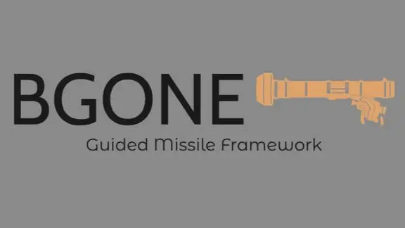

# BGONE: Missile Guidance Framework for Arma Reforger

BGONE is an advanced missile guidance framework for **Arma Reforger**, originally created by **MBFjeld**. The framework is designed to enhance gameplay by providing a variety of missile guidance systems, allowing for more realistic and tactical engagement scenarios.

## Features

BGONE currently supports multiple guidance methods, including:

- **Visual Locking**: Engage targets based on visual identification and tracking.
- **SACLOS (Semi-Automatic Command to Line of Sight)**: Direct the missile to follow the line of sight using manual control.
- **PLOS (Predicted Line of Sight)**: Predicts the path of a moving target and guides the missile to intercept it.

These features are continuously being improved and expanded, providing players with diverse and immersive missile guidance options.

## Getting Started

To start using BGONE in your Arma Reforger environment:

1. **Clone the Repository**: 
   ```bash
   git clone https://github.com/SpaceStrider/BGONE.git
   ```

2. **Load the Mod Into Workbench**: Open Workbench, click the "Add Project" dropdown, and select "Add Existing Project".

3. **Explore the Documentation**: Check out the `docs` directory for detailed instructions on configuring and utilizing each guidance method within the game.

## How to Contribute

We welcome contributions from the community to help improve BGONE. Here are a few ways you can get involved:

1. **Identify Bugs**: Encounter an issue? Report it in the [Issues](https://github.com/yourusername/BGONE/issues) section with as much detail as possible, including steps to reproduce the problem and any relevant logs or screenshots.

2. **Add New Features**: If you have an idea for a new feature or improvement, fork the repository, implement your changes, and submit a pull request. Make sure to provide a clear description of what your changes do and why they should be merged.

3. **Improve Code Quality**: Review the existing codebase for any optimizations or enhancements. Contributions that improve code readability, efficiency, or modularity are highly appreciated.

4. **Enhance Documentation**: Help us improve our documentation! Clear and comprehensive documentation is crucial for user adoption and developer collaboration. If you notice any gaps or inaccuracies, feel free to update the relevant documentation files.

## Community and Support

Join our community of developers and players to discuss BGONE, share your experiences, and provide feedback:

- **Discord**: [The Official Arma server](https://discord.gg/Arma) to chat with other developers and players.

## Acknowledgments

Special thanks to **MBFjeld** for creating BGONE and to the **Arma Reforger** community for their continuous support and contributions.
